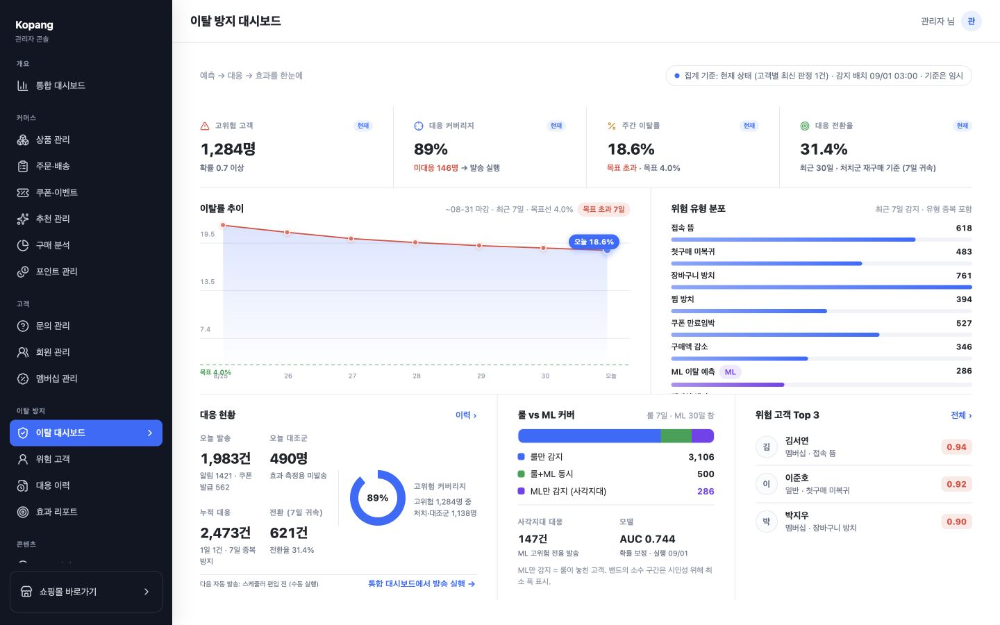
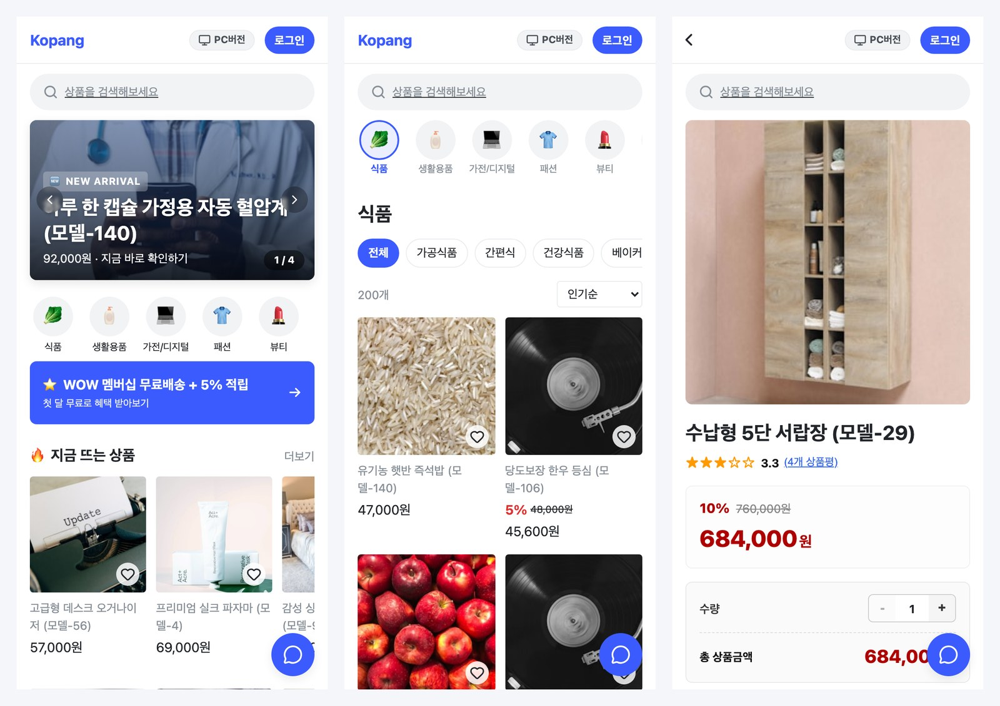
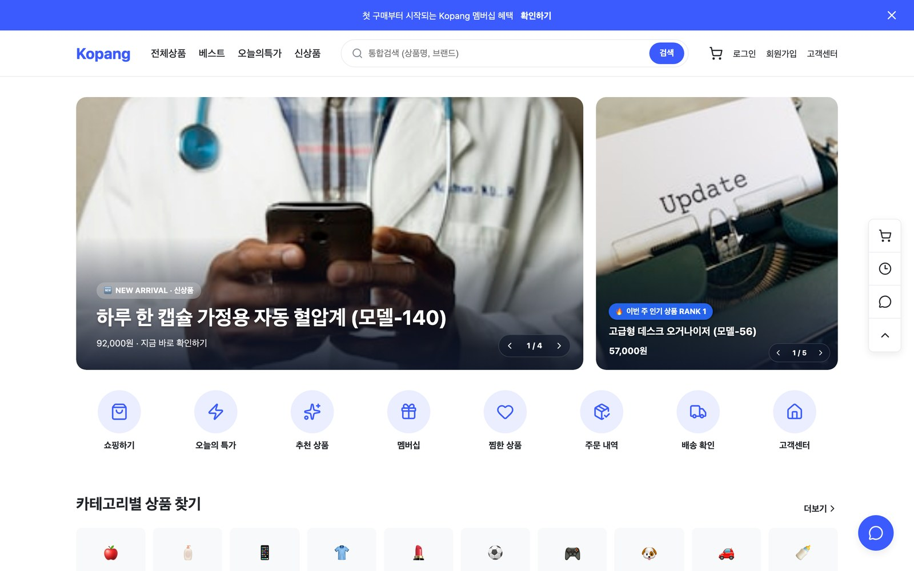
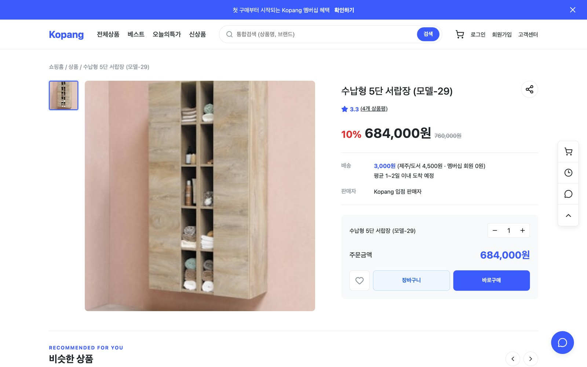
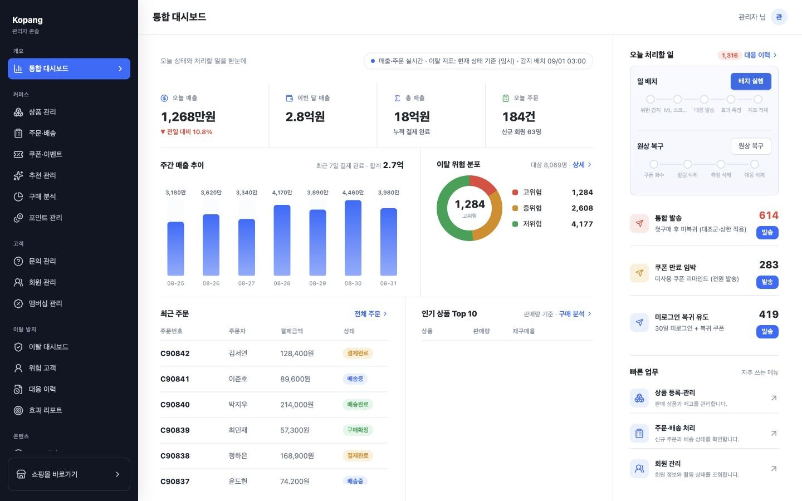
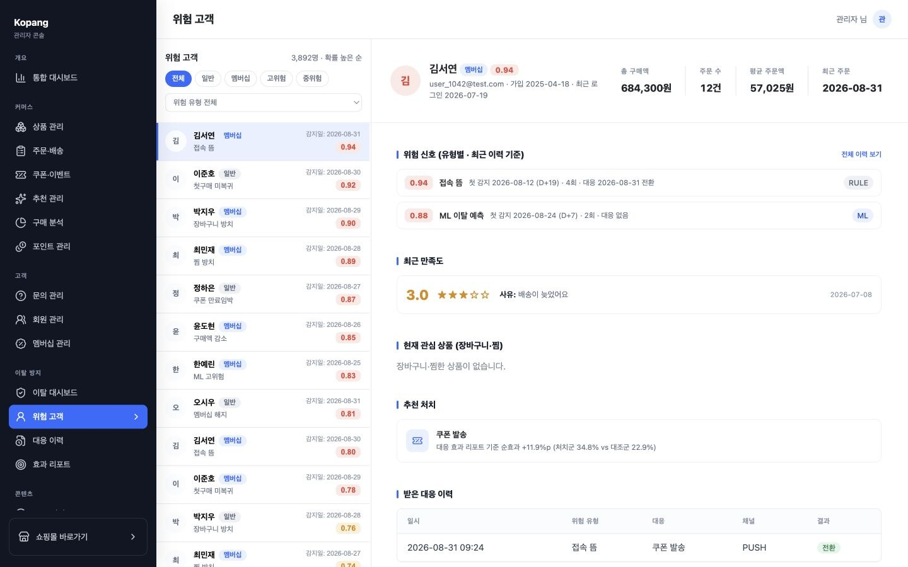
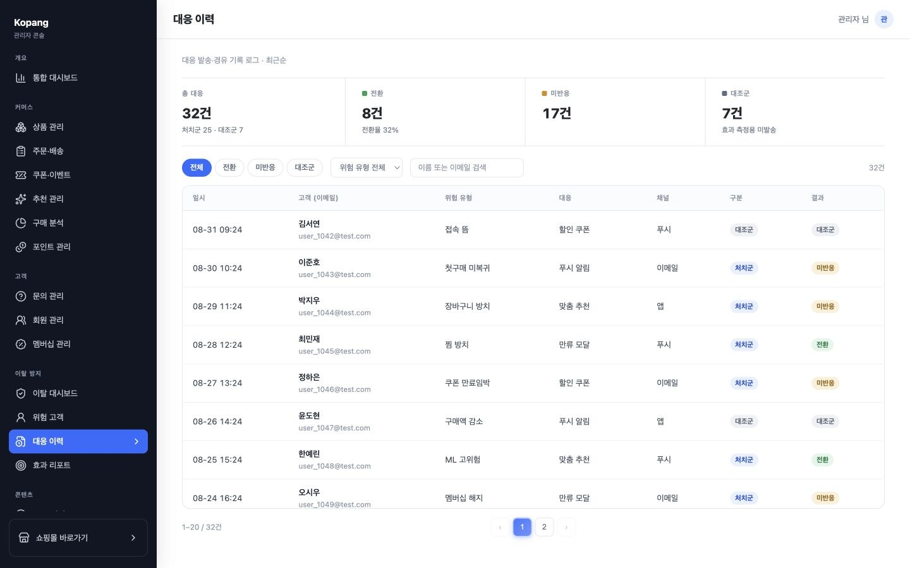
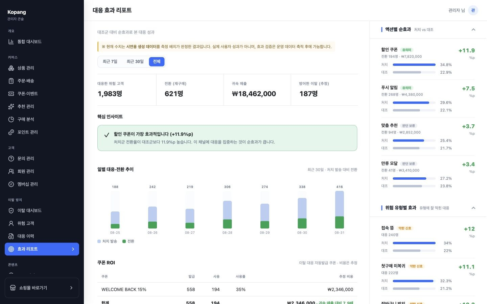

# Kopang (코팡)

고객 행동과 구매 패턴을 분석해 **이탈 위험을 감지하고, 맞춤 대응의 효과까지 측정**하는 풀스택 커머스 프로젝트

- KOSMO 163기 팀 프로젝트 · 4인
- 개발 기간: 2026.07.01 ~ 2026.07.31
- 사용자 쇼핑몰(모바일·데스크톱) + 관리자 콘솔 + ML 이탈 예측 서빙



## 화면

**사용자 쇼핑몰** — 모바일 홈·상품 목록·상품 상세 · PC 홈 · PC 상품 상세

<p align="center">
  <a href="docs/images/readme/06-user-mobile.jpg"></a>
  <a href="docs/images/readme/07-user-web-home.jpg"></a>
  <a href="docs/images/readme/08-user-web-product-detail.jpg"></a>
</p>

**관리자 콘솔 · 이탈 방지** — 통합 대시보드 · 위험 고객 상세 · 대응 이력 · 대응 효과 리포트

<p align="center">
  <a href="docs/images/readme/02-integrated-dashboard.jpg"></a>
  <a href="docs/images/readme/03-risk-customer-detail.jpg"></a>
  <a href="docs/images/readme/04-intervention-history.jpg"></a>
  <a href="docs/images/readme/05-effect-report.jpg"></a>
</p>

> 클릭 시 원본. 화면의 수치는 시연용 생성 데이터 기준

## 핵심 — 감지부터 효과 측정까지

```
고객 행동 데이터
    → 룰·ML 기반 위험 감지
    → 처치군·대조군 분리
    → 알림·쿠폰·모달 등 맞춤 대응
    → 7일간 전환·재방문 측정
    → 관리자 대시보드·효과 리포트
```

**룰과 ML의 역할**

- **Rule Engine**: 명확한 행동 조건으로 위험 유형과 원인을 감지
- **ML Model**: 여러 약한 신호를 결합해 이탈 확률을 예측
- **Blind Spot Detection**: 룰이 찾지 못한 ML 고위험 고객을 별도로 추적

## 이탈 위험 유형 8종

| # | 위험 유형 | 주요 감지 기준 | 현재 대응 |
| --- | --- | --- | --- |
| ① | 장바구니 방치 | 상품을 담은 뒤 3일 이상 유효 주문 없음 | 홈 배너 실시간 노출 |
| ② | 멤버십 해지 | 멤버십 해지 시도 또는 해지 완료 | 실시간 만류 모달 |
| ③ | 첫구매 후 미복귀 | 첫 주문 이후 30일 이상 재구매 없음 | 복귀 쿠폰과 알림 |
| ④ | 찜 방치 | 찜한 뒤 7일 이상 미구매 | 찜 상품 할인 알림 |
| ⑤ | 쿠폰 만료 임박 | 미사용 쿠폰 만료 3일 전 | 만료 안내 알림 |
| ⑥ | 부정경험 | 저평점 리뷰 또는 취소·반품 | 신호 수집·분석 |
| ⑦ | 접속 뜸 | 마지막 로그인 후 30일 초과 | 복귀 쿠폰과 알림 |
| ⑧ | 구매액 감소 | 최근 30일 지출이 직전 30일의 50% 미만 | 대시보드·ML 피처 활용 |

> 모든 감지 유형이 자동 발송으로 이어지는 것은 아님. 중복 대응과 과잉 발송을 막기 위해 유형별 전용 대응 경로 사용

## 대응 효과 측정

- 고객을 처치군과 대조군으로 분리
- 대응 후 7일을 전환 측정 기간으로 사용
- 결제 완료 주문과 재방문 여부를 측정
- 하나의 주문은 가장 가까운 대응 하나에만 귀속
- 처치군과 대조군의 전환율 차이로 순효과 확인

## 기술 스택

| 구분 | 내용 |
| --- | --- |
| Frontend | React 19, TypeScript 6, Vite 8, React Router, Axios |
| Backend | Java 21, Spring Boot 3.5, MyBatis, Spring Security (JWT, OAuth2 Google·Naver), Spring Mail |
| ML | Python, FastAPI, scikit-learn (Logistic Regression), pandas, numpy |
| Database | PostgreSQL |
| Infra·외부 | AWS S3 (이미지), 토스페이먼츠 (테스트 결제), Gemini API (챗봇), AWS EC2 (배포) |
| 협업 | GitHub, Notion |

## 팀 구성 및 담당

| 구분 | 담당 | 범위 |
| --- | --- | --- |
| A 회원·멤버십 | [hat8532](https://github.com/hat8532) | 회원가입·로그인·OAuth, 마이페이지, 멤버십 가입·혜택·해지 |
| B 커머스·검색 | [semingithub](https://github.com/semingithub) | 상품·카테고리·검색, 장바구니, 주문·결제, 쿠폰·포인트 |
| C 이탈방지 | [Hdev-x](https://github.com/Hdev-x) | 위험 유형 8종 룰 감지, ML 점수화 연동, 대응 자동 발송, 처치·대조군 효과 측정, 관리자 이탈 대시보드·효과 리포트 |
| 고객지원 | [kjs844-art](https://github.com/kjs844-art) | 상품 문의, 1:1 문의, 공지, FAQ, AI 챗봇 |

## 폴더 구조

```
kopang/
├── frontend/   # React 사용자·관리자·데스크톱 웹
├── backend/    # Spring Boot API·인증·배치·대응·측정
├── ml/         # 이탈 예측 모델·FastAPI 서빙·데모 데이터
├── docs/       # 요구사항·API·DB 명세, README 이미지
└── outputs/    # 최종 발표자료 등 공유 산출물
```

## 실행 방법

PostgreSQL 준비 후 세 파트를 각각 실행

| 파트 | 명령 | 비고 |
| --- | --- | --- |
| Backend (:8080) | `cd backend && ./gradlew bootRun` | `src/main/resources/application-dev.properties`에 DB·JWT·OAuth·S3·결제·메일 키 설정 (Git 미포함) |
| ML (:8000) | `pip install -r ml/requirements.txt` → `uvicorn ml.model.serve:app --port 8000` | 학습·시드는 [ml/README.md](ml/README.md) |
| Frontend | `cd frontend && npm install && npm run dev` | `/api` 요청은 Vite proxy가 backend로 전달 |

## 문서·발표자료

- [요구사항 정의서](docs/요구사항_정의서.xlsx) · [API 명세서](docs/API_명세서.md) · [DB 스키마](docs/DB_스키마.xlsx)
- [최종 발표자료](outputs/kopang-발표-최종.pptx)
- [ML 이탈방지 구조 정리](docs/_/ML_이탈방지_구조_정리.md)

## 협업 규칙

- 브랜치: `main`(발표·배포) ← `develop`(통합) ← `feature/*`(개인 작업)
- 모든 변경은 `feature/*` → `develop` PR, 리뷰어 1명 이상 승인 후 머지
- 커밋: `feat` `fix` `refactor` `docs` `chore`
