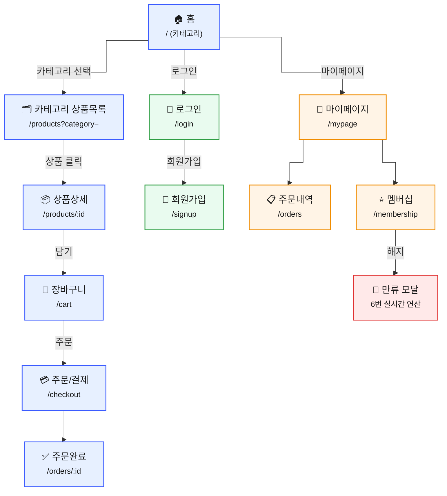

# Copang 화면 명세 초안 (화면 정의 + 흐름)

> 담당: 진한 (프론트 메인) · 상태: 초안 · 업데이트: 2026-06-28
> 화면이 필요로 하는 데이터 = [API 명세](API_명세_초안.md)의 근거. 둘은 한 쌍.
> ✅ 구현됨 / 🔲 예정

---

## 1. 화면 흐름도

> 메인 흐름만 표시 (아래로 흐르는 트리). 다음은 별도 표기:
> - **전역 헤더**: 장바구니 · 마이페이지 · 로그인은 어느 화면에서나 헤더로 접근 (그래서 흐름도엔 생략)
> - **복귀**: 로그인/회원가입 성공 → 홈 또는 직전 화면으로 복귀

---

## 2. 화면 목록
| 화면 | 경로 | 인증 | 상태 | 우선순위 |
| --- | --- | --- | --- | --- |
| 홈 | `/` | ✕ | 🔲(현재 목록형) | P0 |
| 카테고리 상품목록 | `/products?category=` | ✕ | ✅ | P0 |
| 상품상세 | `/products/:id` | ✕ | ✅ | P0 |
| 장바구니 | `/cart` | 🔒 | ✅(골격) | P0 |
| 로그인 | `/login` | ✕ | ✅(골격) | P0 |
| 회원가입 | `/signup` | ✕ | 🔲 | P0 |
| 주문/결제 | `/checkout` | 🔒 | 🔲 | P0 |
| 주문완료 | `/orders/:id` | 🔒 | 🔲 | P0 |
| 주문내역 | `/orders` | 🔒 | 🔲 | P1 |
| 마이페이지 | `/mypage` | 🔒 | 🔲 | P1 |
| 멤버십 | `/membership` | 🔒 | 🔲 | P1 |

---

## 3. 화면별 상세

### 🏠 홈 `/` 🔲 (현재는 목록형으로 구현됨)
- **구성**: 헤더(로고/장바구니/로그인), **카테고리 진입(메뉴/타일)** + 추천/배너
- **데이터**: `GET /api/categories` (카테고리 목록) — *없으면 고정 enum으로 시작 가능*
- **이동**: 카테고리 선택 → 카테고리 상품목록 / 헤더 장바구니·로그인·마이페이지
- ⚠️ 현재 코드(`ProductListPage`)는 `/`에 *상품목록*이 바로 있음 → 홈(카테고리)과 상품목록을 분리하는 작업 필요

### 🗂️ 카테고리 상품목록 `/products?category=` ✅
- **구성**: 선택된 카테고리의 상품 카드 그리드(2열), 정렬/필터/페이징
- **데이터**: `GET /api/products?category={cat}` (API 명세에 이미 있음)
- **이동**: 상품 카드 → 상품상세

### 📦 상품상세 `/products/:id` ✅
- **구성**: 상품 정보(이미지/이름/가격/설명), 장바구니 담기 버튼, 리뷰 목록(착샷)
- **데이터**: `GET /api/products/{id}`, `GET /api/products/{id}/reviews`
- **이동**: 담기 → 장바구니 반영 / 리뷰작성(로그인 시) → 리뷰 작성

### 🛒 장바구니 `/cart` 🔒 ✅(골격)
- **구성**: 담은 항목 리스트(수량 조절/삭제), 합계, 주문 버튼
- **데이터**: `GET /api/cart`, `PATCH/DELETE /api/cart/{itemId}`
- **이동**: 주문하기 → `/checkout`

### 🔑 로그인 `/login` ✅(골격)
- **구성**: 이메일/비밀번호 폼, 로그인 버튼, 회원가입 링크
- **데이터**: `POST /api/auth/login` → 토큰 sessionStorage 저장
- **이동**: 성공 → 홈 / 회원가입 → `/signup`

### 📝 회원가입 `/signup` 🔲
- **구성**: 이메일/비번/이름 폼, 가입 버튼
- **데이터**: `POST /api/auth/signup`
- **이동**: 성공 → 로그인 또는 자동 로그인 → 홈

### 💳 주문/결제 `/checkout` 🔒 🔲
- **구성**: 주문 상품 요약, 배송지, 결제(mock), 주문 버튼
- **데이터**: `POST /api/orders`
- **이동**: 완료 → 주문완료

### ✅ 주문완료 `/orders/:id` 🔒 🔲
- **구성**: 주문 번호/내역, 홈/주문내역 버튼
- **데이터**: `GET /api/orders/{id}`

### 📋 주문내역 `/orders` 🔒 🔲 (P1)
- **구성**: 내 주문 리스트
- **데이터**: `GET /api/orders`

### 👤 마이페이지 `/mypage` 🔒 🔲 (P1)
- **구성**: 내 정보, 멤버십 상태, 주문내역/찜/쿠폰 진입
- **데이터**: `GET /api/memberships/me` 등

### ⭐ 멤버십 `/membership` 🔒 🔲 (P1)
- **구성**: 멤버십 혜택/가입, **해지 버튼 → 만류 모달**(아낀 배송비 등)
- **데이터**: `GET /api/memberships/me`, `POST /api/memberships/cancel` ← **6번 구독해지(진한 담당) 실시간 연산**
- **이동**: 해지 클릭 → 록인 모달 표시

---

## 4. 공통 요소
- **헤더(Layout)**: 로고(→홈) / 장바구니 / 로그인·로그아웃(인증 상태에 따라). 마이페이지 진입 추가 예정
- **모바일 퍼스트**: 본문 최대폭 `--max-width`(480px) 컨테이너
- **인증 가드**: 🔒 화면은 미로그인 시 `/login`으로 리다이렉트 (예정)
